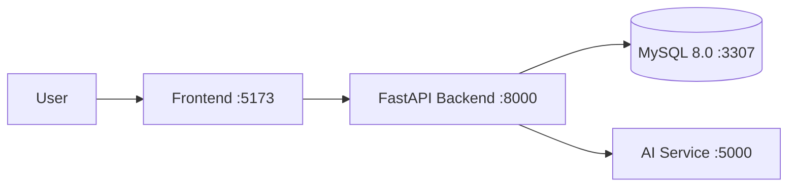

# VLUR-Captcha

VLUR-Captcha is an AI CAPTCHA SaaS project designed to provide users with a simple, seamless verification experience while giving services a reliable way to distinguish automated bots from real users.

> This repository is currently in the early stages of development. The FastAPI backend includes health and database connectivity checks, and the MySQL schema and development seed data are implemented. The frontend and AI services are currently skeletons with only their directory and container structures in place.

## Key Features

- Behavioral CAPTCHA design based on drag trajectories (`type1_drag`)
- Selection-based CAPTCHA design for identifying images and labels (`type2_identify`)
- API key issuance and active-status management
- API and CAPTCHA usage limits by subscription plan
- Logging of verification results, drag coordinates, and bot classification results
- Management of payment history, announcements, and Q&A data
- Docker Compose-based local development environment

## Current Implementation Status

| Area | Status | Details |
| --- | --- | --- |
| Backend | Basic features implemented | FastAPI server, health check, and database connectivity check |
| Database | Implemented | MySQL 8.0 schema and development seed data |
| Frontend | In progress | Development Dockerfile only |
| AI | In progress | Service directory only |
| Kubernetes / Nginx | In progress | Directories prepared for deployment configuration |

## System Architecture



Only the `db` and `backend` services can currently be run locally. To run the entire stack, you must first add the frontend application files and a Dockerfile for the AI service.

## Tech Stack

- Backend: Python 3.12, FastAPI, Uvicorn, PyMySQL
- Database: MySQL 8.0
- Frontend: Node.js 24-based development environment
- Infrastructure: Docker, Docker Compose
- Planned: AI inference service, Nginx, Kubernetes

## Directory Structure

```text
AI-Captcha/
├── AI/                       # Planned AI inference service
├── backend/
│   ├── Dockerfile.dev
│   ├── main.py               # FastAPI application
│   └── requirements.txt
├── database/
│   └── init/
│       ├── 01_schema.sql     # Tables and constraints
│       └── 02_seed.sql       # Initial development data
├── frontend/
│   └── Dockerfile.dev        # Frontend development image
├── k8s/                      # Planned Kubernetes manifests
├── nginx/                    # Planned reverse proxy configuration
├── docker-compose.yml
└── README.md
```

## Getting Started

### Prerequisites

- Git
- Docker Desktop or Docker Engine
- Docker Compose v2

### 1. Clone the Repository

```bash
git clone https://github.com/kakao-NoBot/AI-Captcha.git
cd AI-Captcha
```

### 2. Configure Environment Variables

Create a `.env` file in the project root.

```dotenv
DB_ROOT_PASSWORD=change-this-root-password
DB_NAME=captcha
DB_USER=captcha_user
DB_PASSWORD=change-this-db-password
DB_HOST=db
DB_PORT=3306
```

The `.env` file is excluded from Git. Do not commit real passwords or production secrets to the repository.

### 3. Start the Database and Backend

```bash
docker compose up --build db backend
```

Once the services are ready, check their status at the following endpoints:

```bash
curl http://localhost:8000/health
curl http://localhost:8000/db-check
```

Expected health response:

```json
{"status":"ok"}
```

The automatically generated FastAPI documentation is available at:

- Swagger UI: <http://localhost:8000/docs>
- ReDoc: <http://localhost:8000/redoc>

### 4. Stop the Services

```bash
docker compose down
```

MySQL data is preserved in the `captcha_mysql_data` volume. To recreate the schema and seed data from scratch, remove the local database volume and restart the services.

```bash
docker compose down -v
docker compose up --build db backend
```

> `docker compose down -v` deletes all data in the local MySQL volume.

## API

The following development endpoints are currently available:

| Method | Endpoint | Description |
| --- | --- | --- |
| `GET` | `/health` | Checks the backend server status |
| `GET` | `/db-check` | Retrieves database tables and a subset of the seed data |

`/db-check` is a development endpoint for verifying database connectivity. Because its response includes user and CAPTCHA data, do not expose it as-is in a production environment.

## Database

When the MySQL volume is created for the first time, the SQL files in `database/init` are executed once in filename order.

| Table | Purpose |
| --- | --- |
| `plans` | Subscription plans and monthly usage limits |
| `users` | User and administrator accounts and subscription information |
| `payments` | Payment status and payment gateway transaction information |
| `api_keys` | Hashed API keys and their active status |
| `boards` | Announcements and Q&A posts |
| `answers` | Administrator responses |
| `captcha_images` | Image metadata for questions and answer choices |
| `captchas` | CAPTCHA types and correct-answer information |
| `captcha_options` | Answer choices for selection-based CAPTCHAs |
| `captcha_verifications` | Answers, drag trajectories, bot classifications, and one-time tokens |

The development seed data includes Free, Basic, and Pro plans, test users, a sample API key, and examples of both CAPTCHA types. Password hashes for seeded accounts are placeholder values and cannot be used for actual sign-in.

## Development Notes

### Adding the Frontend Service

The current `frontend/Dockerfile.dev` expects a `package.json` file and an `npm run dev` script. After adding the frontend source code and package configuration, run the service with:

```bash
docker compose up --build frontend
```

### Adding the AI Service

`docker-compose.yml` is configured to build an image from the `AI/` directory and expose port 5000. After adding the AI API server and its Dockerfile, start the full stack with:

```bash
docker compose up --build
```

## Security Checklist

- Hash passwords with a proven algorithm such as bcrypt
- Store only SHA-256 hashes of API keys, never the original keys
- Remove development users, API keys, and seed data from production environments
- Remove `/db-check` in production or protect it with administrator authentication
- Inject environment-specific secrets through a dedicated secrets management system
- Enforce expiration and single-use policies for CAPTCHA verification tokens

## Roadmap

- [ ] User registration, sign-in, and administrator authentication
- [ ] API key issuance and revocation API
- [ ] CAPTCHA generation and verification API
- [ ] Integration with a drag-trajectory-based bot classification model
- [ ] Integration with an image-identification CAPTCHA model
- [ ] Subscription plan and payment API integration
- [ ] User and administrator frontend implementation
- [ ] Nginx and Kubernetes deployment configuration
- [ ] Automated tests and CI pipeline

## Contributing

1. Fork the repository.
2. Create a working branch.
3. Commit your changes together with the relevant tests.
4. Describe the purpose of the changes and how they were verified in the pull request.

Please use [GitHub Issues](https://github.com/kakao-NoBot/AI-Captcha/issues) to report bugs or suggest features.

## License

This repository currently does not include a separate license file. Contact the repository maintainers before using, modifying, or distributing the code.
